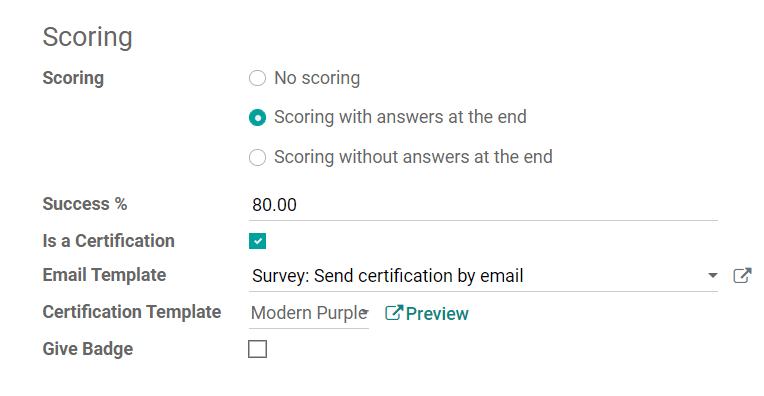
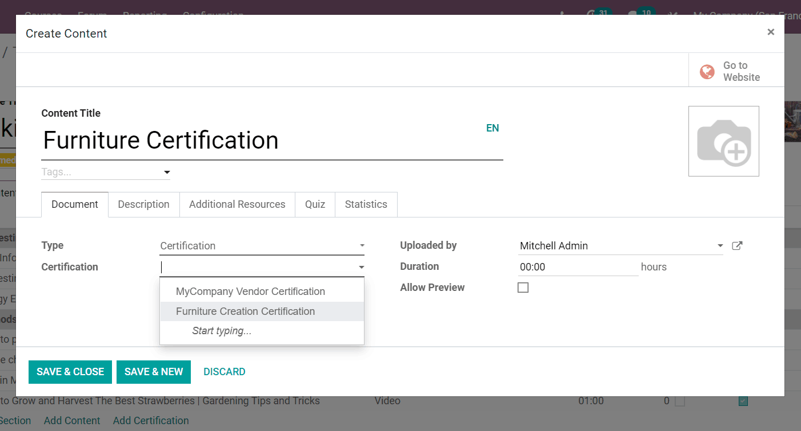
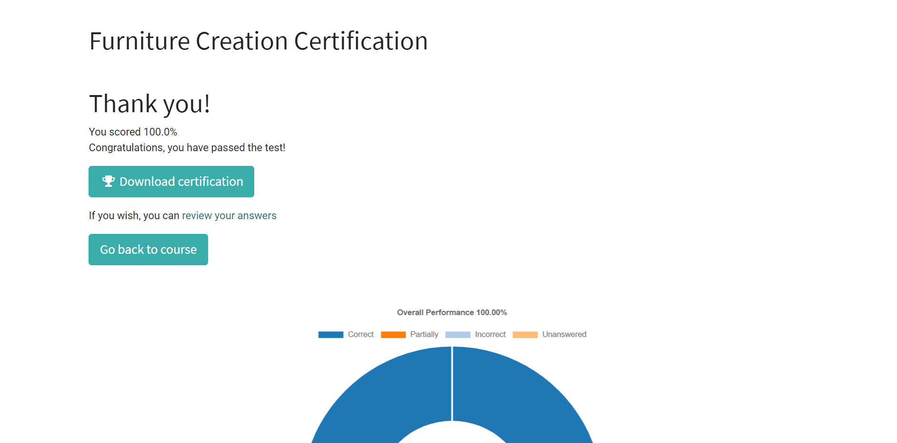

=====================
Create certifications
=====================

Certifications are a great way to reward your most studious eLearning participants. Users can
place certifications in their eLearning courses as an official way to "certify" their
participants' knowledge and expertise level.

If you taught an eLearning course on woodworking, for example, you can create a generic
certification filled with a collection of important questions pertaining to woodworking. You can
even apply it to any other courses that cover similar topics.

Odoo allows users to create numerous certifications, and adhere them to as many courses as they'd
like, without having to recreate new certifications for each course. Talk about convenient!

Getting started
===============

Click on *Certifications* under the *Courses* menu.

Then, click on *Create*.

After titling the certification, users can start adding questions and sections, just like they
would when creating a standard eLearning course (or survey).

Users can elaborate on the certification, or offer any additional information, in the Description
tab. In the *Options* tab, users can thoroughly customize their certification. In the *Scoring*
section, users can set the success percentage needed to "pass" the certification.

They can also modify the email and certification template that the participants will see. In
addition to that, users can also choose to activate the "Give Badge" feature, which rewards
participants with a virtual "badge" for successfully completing the certification.

Once you've completed your customizations, hit *Save*, and the certification
is then finalized, but it can be modified at any time.

Also, in the upper-right corner of the certification template, you'll see smart buttons for:
*Courses*, *Certified*, and *Answers*.

.. image:: ./media/certification-smart-buttons.png
   :align: center
   :alt: certification smart buttons

*Courses* tells the user how many courses are currently featuring this specific certification.
*Certified* tells the user how many people have been successfully certified, via this certification.
And, lastly, *Answers* takes the user to a page showcasing all the answers to the certification
questions from each participant.

Applying certification to courses
=================================

Open the template of the course you want to add a certification to, and click on *Add
Certification*. Then, a pop-up will appear, in which users can title the Certification Content in
your course, and then select which Certification you want to apply.

Users can also add an image, *Description*, *Additional Resources*, or a *Quiz*. You can also view
*Statistics* of the certification here, as well.

Certifications in eLearning courses
===================================

Once participants encounter the certification, they will be presented with a unique "Pass
Certification" button.

When pressed, it will take them to a Certification prompt page. Once they are are ready, they can
begin their certification.

After entering their answers to the certification questions, participants will be taken to a
results page.

Here, they'll see their success percentage, along with a graph, visually representing their
answer attempts.

If they pass, they can click on *Download Certification* and have the certification immediately
downloaded onto their computer for reference. They can also revisit the course by clicking on *Go
back to course*.
