==============
Create courses
==============

Odoo eLearning helps users create and customize courses with incredible content *and* gets them
online for participants to enjoy in just a matter of minutes.

Configuration
=============

When you install and open the eLearning application, you will see the eLearning dashboard, which is
the Course Overview, by default. You can also access the course creation page by selecting *Courses*
under the *Courses* drop-down menu.

Create course
=============

On the dashboard, you'll find access to all courses that have already been created. To create a new
course, click *Create*.

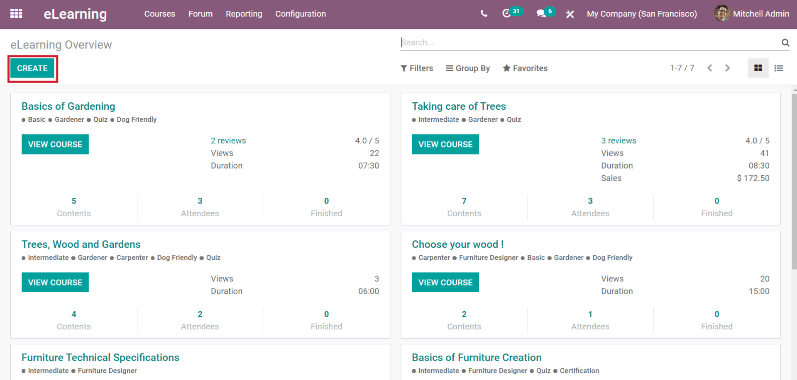

Clicking *Create* will take you to an empty course form. Here, you can fully customize
and configure your course, give it a title, and add all sorts of content.

Make sure to complete the following fields when creating a new course:

*  **Course Title** pick a name for your course
*  **Tags** create (and edit) tags for your course to help your participants search for (and
   find) your course.
*  **Image** click the photo icon to upload a .png file to visually represent your course.

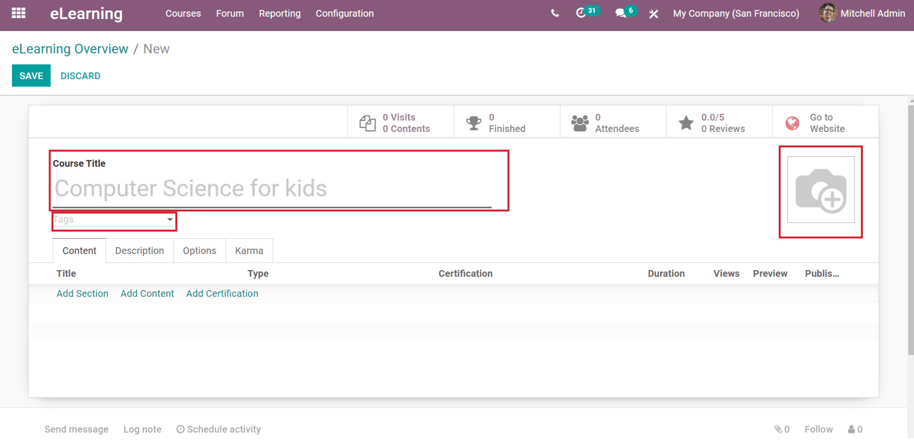

Course configuration
====================

You can configure your course as soon as you create it. You can modify the
configuration of any course at any time, simply by clicking the *Edit* button. Once you're done,
remember to hit *Save*.

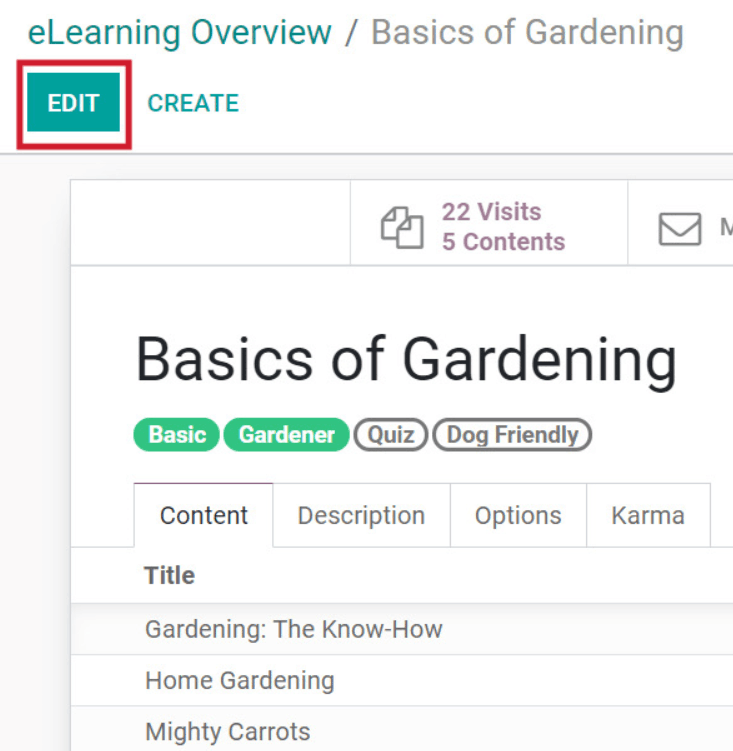

Options
-------

You will find the most **important** configurations for your course under the *Options* tab.

Course
~~~~~~

Course type
***********

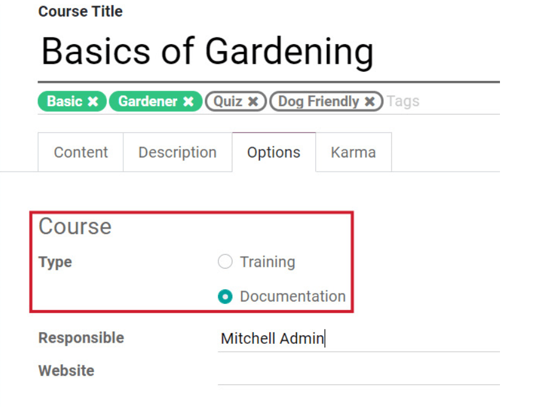

*Training* courses allow users to track the progress of your participants, while *Documentation* is
best used when you want to visually showcase content within your course. Here’s the same course
showcasing the different displays.

*  **Documentation**

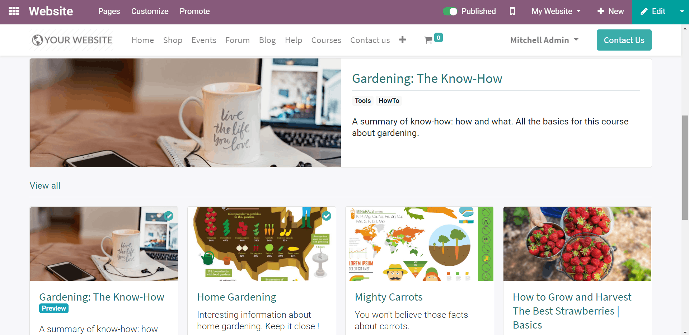

*  **Training**

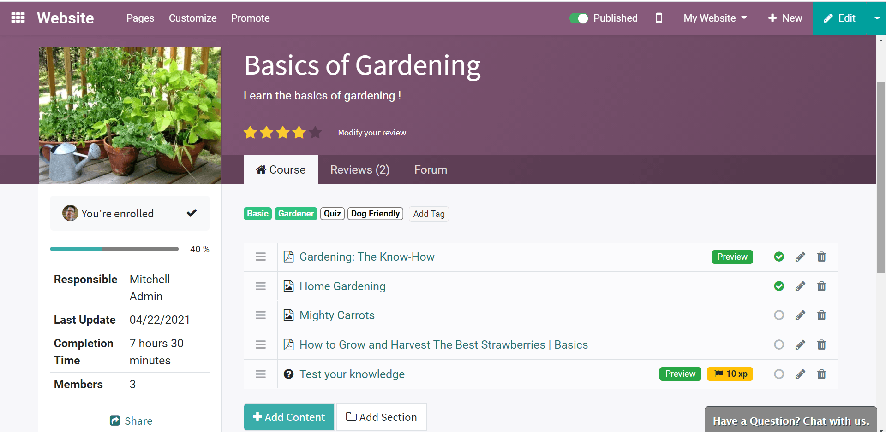

Course responsible
******************

You will have to designate a “Responsible” for each course. The “Responsible” will be
able to access every aspect of the course. They’ll be able to see the attendee list, send emails,
add content, and so much more.

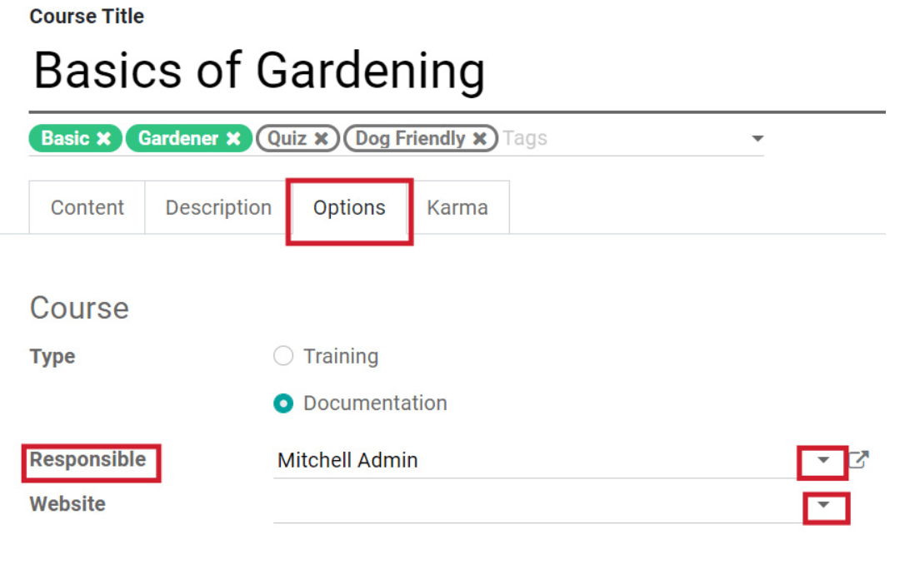

The “Responsible” can be changed at any time. Simply click the arrow next to their name, and select
a new “Responsible.” Also, if you are working with multiple websites, you can choose *which* website
this course will be displayed on in this section, as well.

Access rights
~~~~~~~~~~~~~

The “Access Rights” section allows you to decide who can have access to your course. If you select
*Public*, anyone who finds the course on your website will be able to enroll in it, and access the
content.

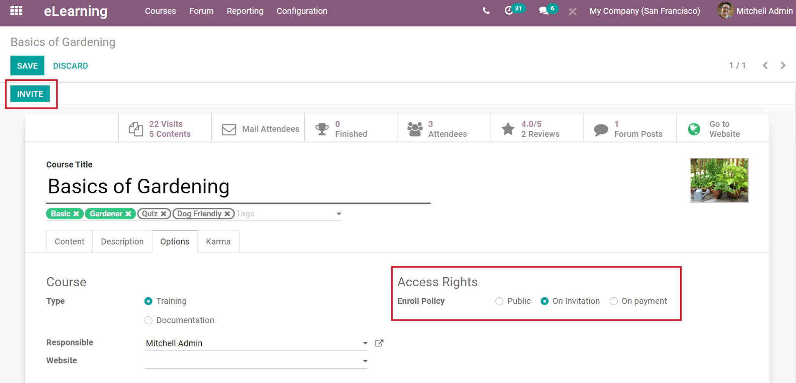

Users can send invites to courses from the main eLearning dashboard. Click the three-dot settings
button on the desired course, and select *Invite*. Then, you can proceed to send an emailed
invitation(s) to potential participants.

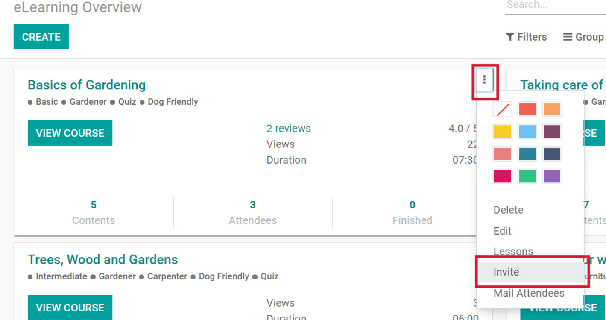

If you pick *On Invitation* in the *Enroll Policy*, an *Invite* smart button will be present on the
course page. This feature enables users to send more mail to potential participants.

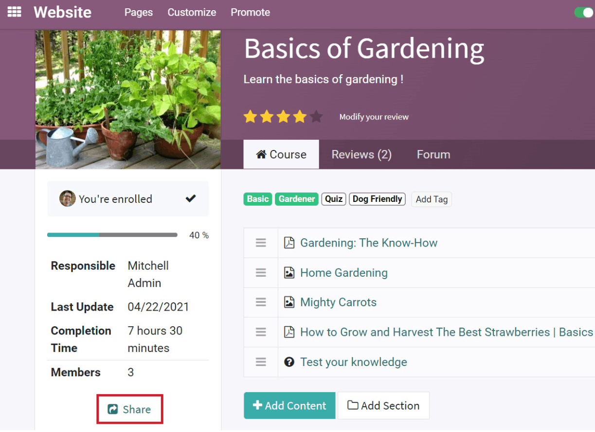

Users can also invite people to participate from the course page on the front-end of your website,
via the *Share* button. Clicking that button will provide you with an access link to your course.
Copy the link, and send it to anyone you’d like to join your course. There is also an option to
share the course on *Social Networks*.

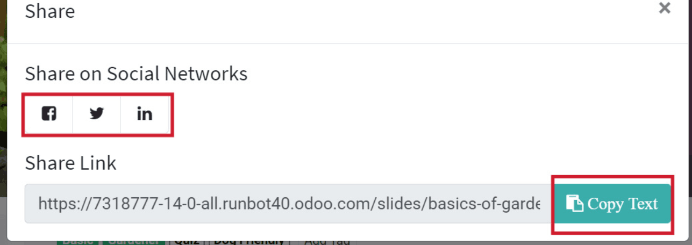

Display
~~~~~~~

If the course *Visibility* is set on “Public,” everyone will be able to see and access the course.
When it’s set on “Members Only,” only invited attendees will be able to participate in the course.

Here, you can also choose what content will appear first in your course.

*  **Latest Published** the most recent content will be first
*  **Most Voted** the most liked content (voted on by your participants) will be first
*  **Most Viewed** the most viewed content in your course will be first
*  **Specific** you can choose which content will be first
*  **None** indicates there is no preference about what content shows up first

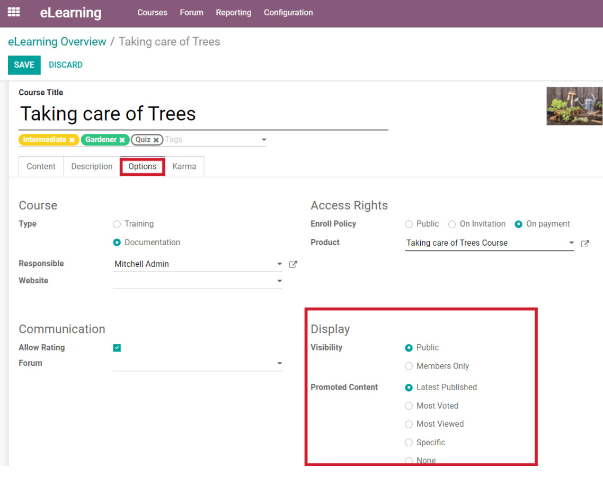

Here’s what the "Featured Content" will look like to your course participants. As you can see, it’s
clearly highlighted and resting above the rest of the content.

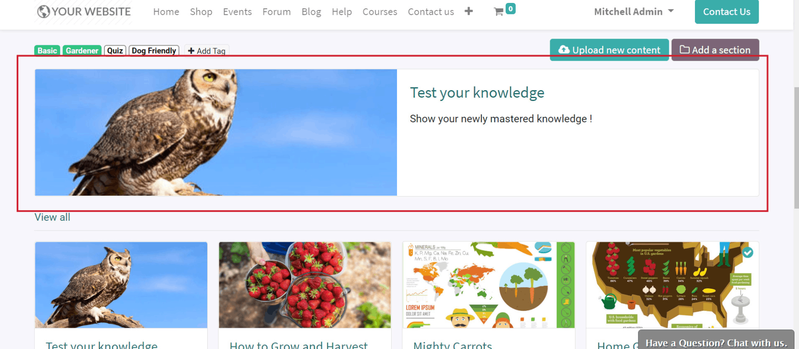

.. note::
   The display will only be affected like this if you have chosen *Documentation* as the "Course
   Type."

Description
-----------

This tab is fairly self-explanatory. Here, you can write a brief description of the course
(and its content). These descriptions are a great way for participants to know what they can
expect from the course.

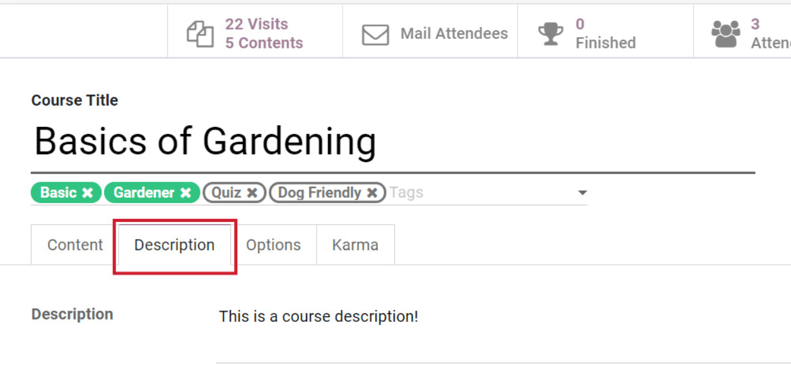

These unique descriptions will appear near the title of your course, on the front-end of your
website. Also, once the course is published, anyone who enrolls will have access to the description.

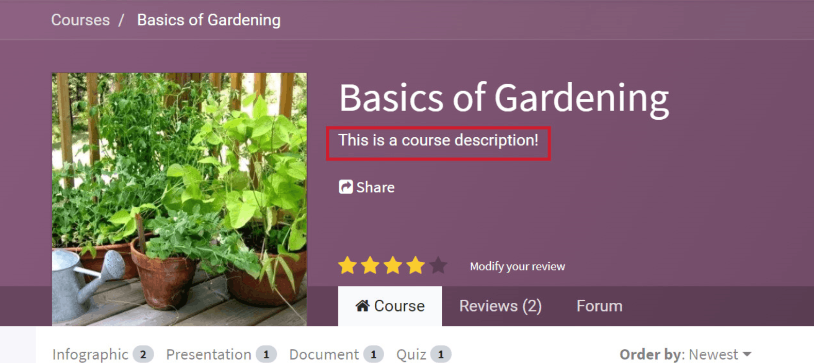

Publishing courses
------------------

By default, every course is “Unpublished” and not viewable on the website.
You’ll know if a course still needs to be published, if the Earth icon in the *Go to Website* smart
button on your course template is red.

To change that course’s status to “Published,” simply click that button to be taken to the
front-end of your website to modify its status.

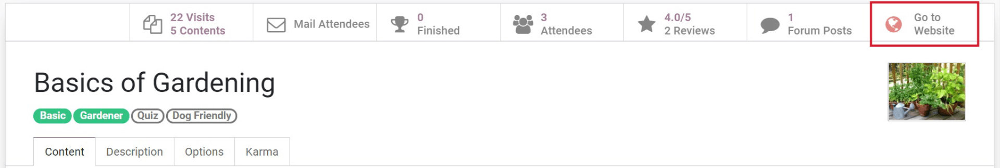

Once on the website, you'll find a "Publish" switch, located on the header of the course page.
This switch allows users to "Publish" and "Unpublish" courses instantly.

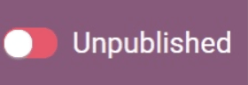

Edit from website
=================

Remember, once a course is created, you can edit it anytime from the front-end of the website, too.
You can also add content to your course from here by clicking the *+Add Content* button.

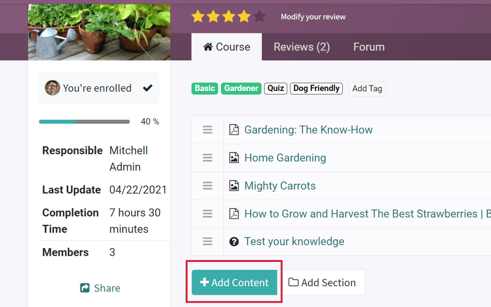

Users can also modify the layout of their course with Odoo’s intuitive building blocks. To access
those features, simply click the *Edit* button in the upper right corner, and start making any
changes that you’d like.

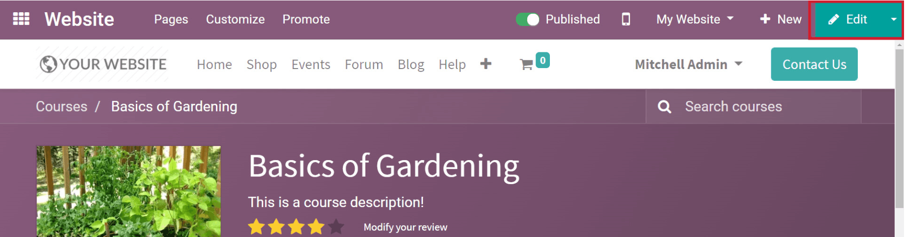
